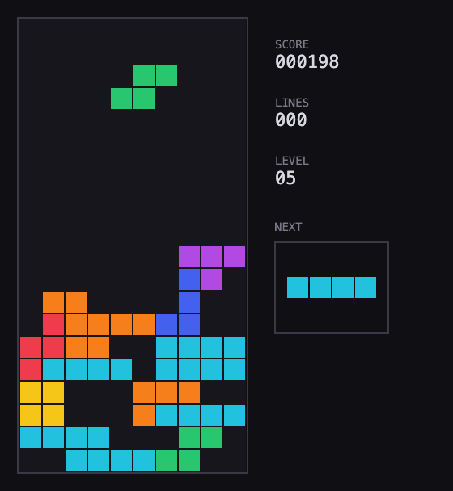
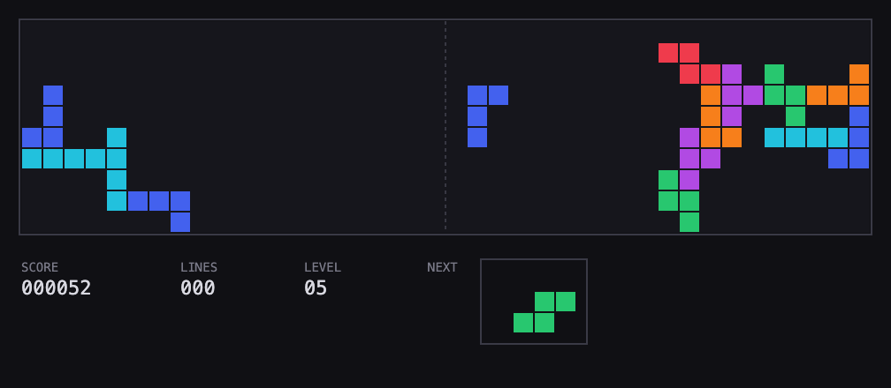
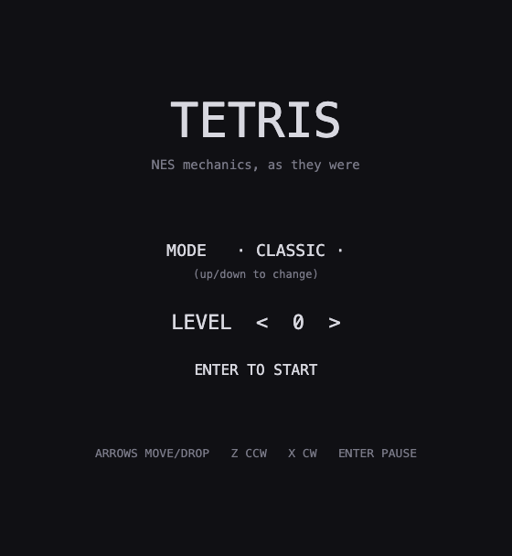

# NES Tetris — mechanics as they were

A from-scratch implementation of the 1989 NES Tetris ruleset (NTSC), built
as an engineering study. Every mechanic on the cartridge, none of its
presentation, and none of the modern guideline: no hold, no ghost piece, no
hard drop, no wall kicks, no 7-bag. Plus an original **horizontal mode**:
two wells joined at a central seam, pieces randomly bound to a side.

The fidelity is tested, not felt: every published NES number (gravity
table, DAS timing, scoring, entry delay, the randomizer's LFSR) is asserted
by the test suite.

| Classic | Horizontal |
|---|---|
|  |  |

## Getting started

Requires [Node.js](https://nodejs.org) 20+.

```sh
npm install      # install dependencies
npm run dev      # start the dev server, open the printed localhost URL
```

Other commands:

```sh
npm test         # run the mechanics test suite (64 tests)
npm run check    # typecheck
npm run build    # production build to dist/
npm run build:deploy  # production build based at /games/tetris/ (davidslv.uk deploy)
```

## Install & play offline

The game is zero-asset — the board is code-drawn and every sound is synthesised
with the Web Audio API, so there are no runtime network calls. A small PWA layer
(`public/manifest.webmanifest` + `public/sw.js`) makes that installable: on the
first online visit the service worker precaches the app shell and the hashed
bundle, so the game launches with **no network** thereafter.

On a phone, open the deployed page and choose **Add to Home Screen** (Safari) or
**Install app** (Chrome). It then opens fullscreen and plays fully offline — in
flight mode, underground, anywhere. The service worker is registered in
production builds only, so the dev server and the test suite are unaffected.

## How to play

**Menu**: Up/Down switches mode (classic / horizontal), Left/Right or the
digit keys pick the starting level (0-9), Enter starts. Higher starting
levels are faster and score more per line.



**Classic mode**

| Key | Action |
|---|---|
| ← → | move left / right (hold for auto-shift) |
| ↓ | soft drop (1 point per row, awarded at lock) |
| Z / X | rotate counter-clockwise / clockwise |
| Enter | start / pause |

Clear horizontal lines to score: 40 / 100 / 300 / 1200 points for 1-4
lines, multiplied by (level + 1). The level (and the speed) rises every 10
lines. The game ends when the stack reaches the spawn row.

**Horizontal mode**

Pieces spawn at the centre seam and are randomly assigned to fall left or
right; the side is decided at spawn and never announced in advance. Lines
are full vertical columns; either stack reaching the seam ends the game.

| Key | Action |
|---|---|
| ↑ ↓ | move up / down (hold for auto-shift) |
| ← → | soft drop, only the arrow pointing at the piece's wall works |
| Z / X | rotate counter-clockwise / clockwise |
| Enter | start / pause |

Things that look like bugs but are correct 1989 behaviour: rotation next
to a wall fails silently (no wall kicks), the I piece cannot go vertical at
the very top, and pausing hides the playfield (no free planning time).

## Documentation

The `docs/` folder documents the game in depth:

- [Intent](docs/intent.md) — what this project is, why it exists, and how
  fidelity is verified.
- [Mechanics](docs/mechanics.md) — every rule with its exact numbers, and
  the list of deliberate deviations from cycle-exact NES behaviour.
- [Horizontal mode](docs/horizontal-mode.md) — the design of the two-well
  mode, its controls, and the side-coin bias investigation.
- [Architecture](docs/architecture.md) — functional core / imperative
  shell, the data representations, and the design principles followed
  (and deliberately refused).

## License

[MIT](LICENSE).
