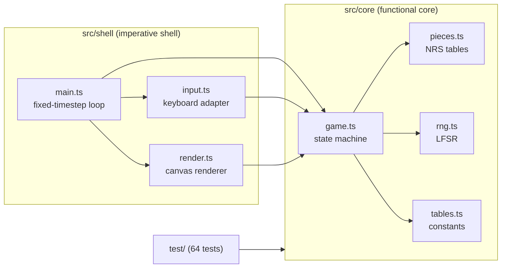
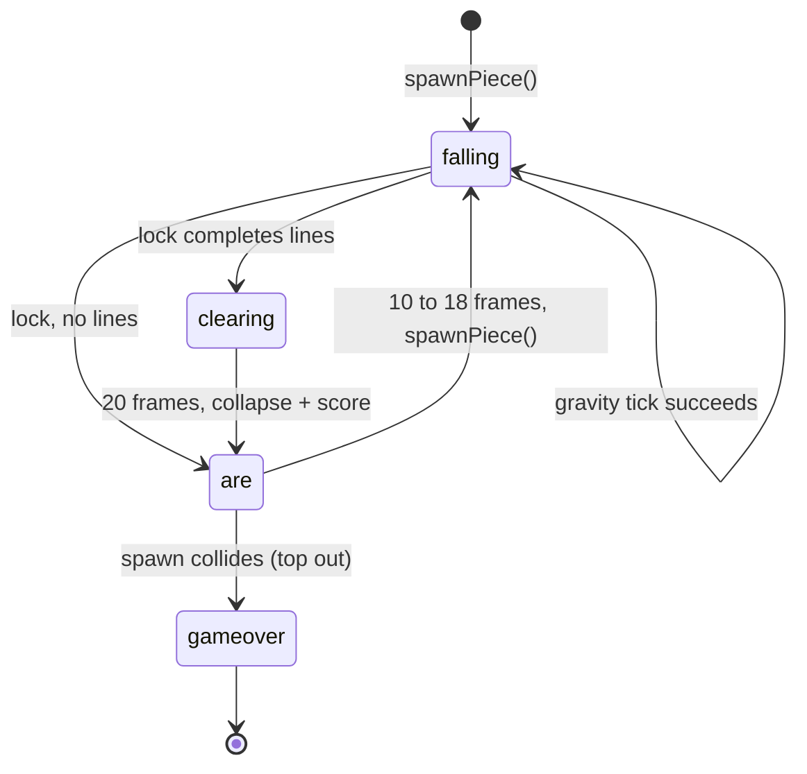
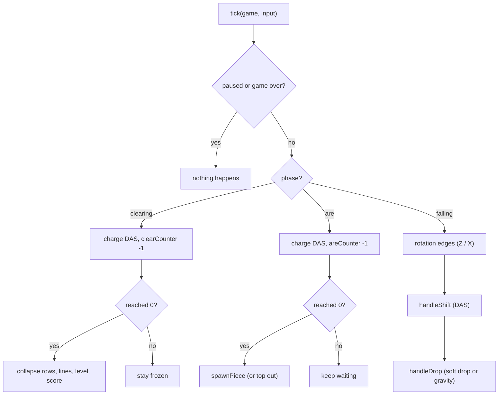
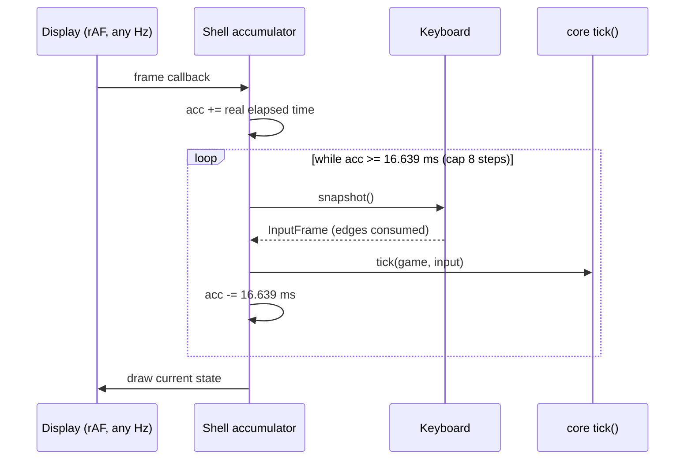

# Architecture

One organising decision, three supporting habits, restraint about
everything else.

## Functional core, imperative shell

```
src/core/    pure game logic, no DOM, no clocks, no I/O
  pieces.ts  NRS orientation tables (data, not trigonometry)
  rng.ts     the NES LFSR, piece picker, side coin
  tables.ts  every published constant, named and tested
  game.ts    the state machine: one tick() per NTSC frame
src/shell/   the browser around it
  input.ts   keydown/keyup to per-frame input; OS key-repeat ignored
  render.ts  flat canvas drawing, including the rotated horizontal wells
  main.ts    fixed-timestep accumulator at 60.0988Hz
test/        the executable specification (64 tests)
```

The import graph enforces the one-way dependency: the shell imports the
core, never the reverse, and the tests sit directly on the core.



The core exports one verb: `tick(game, input)` advances the world exactly
one NTSC frame. Time itself arrives as function calls; the core counts
frames like the 6502 did. This is why the tests need zero mocks and why
horizontal mode never touched the rules.

## State is plain data

`Game` is a flat record of numbers and arrays. A well is a `Uint8Array`
of 200 bytes (0 empty, otherwise pieceId + 1), which makes collision a
single index lookup and line collapse a single `copyWithin`. The active
piece is four numbers `{id, rot, x, y}` and does not exist on the board
until it locks; the renderer composites it on top.

## One spatial primitive

`collides(board, id, rot, x, y)` is the only spatial question in the game.
Every mechanic is the same sentence: propose a transform, test it, commit
or refuse. "No wall kicks" is therefore the absence of a fallback, not a
feature: `tryRotate` fails and that is the whole mechanic.

## The data structure carries the rule

Pieces are tables in clockwise order; `rotateCw` is `(rot + 1) % length`.
S, Z and I toggle because their arrays have length 2; O cannot rotate
because its array has length 1. No piece-specific branches exist. When the
data shape encodes the invariant, the code cannot violate it.

## Mechanics that emerge instead of being coded

- **Locking** is a failed gravity tick. No lock-delay timer exists, so
  floor slides emerge: between gravity ticks a resting piece still
  responds, and the window shrinks as gravity accelerates.
- **Wall charging** is a blocked auto-shift leaving the DAS counter at
  full charge. One non-action, no special code.
- **Seam integrity** in horizontal mode: pieces cannot cross because
  moving against gravity is not expressible.

## The phase machine



Each delay is a counter decremented once per tick. `spawnPiece` is the only
door back into `falling`; game over is `spawnPiece` finding its cells
occupied. Pause is a flag, not a phase: it freezes whichever phase is
running. Within one `falling` tick, the order of operations is fixed:



## Determinism

Seedable LFSR plus frame-counted time means any game is reproducible from
`(seed, startLevel, input sequence)`. This made the side-coin bias
measurable in a one-line simulation of the exact production code path, and
it makes every test deterministic without mocks.

## The loop

The shell never trusts `requestAnimationFrame`'s rate (modern displays
fire it at 120Hz). It accumulates real elapsed time and drains it in fixed
steps of 1000 / 60.0988 ms. rAF draws; the accumulator decides how many
frames actually happened. A step cap stops a backgrounded tab from
fast-forwarding on return.



## Principles deliberately refused

- No classes, no immutability, no state library. The state has exactly one
  owner ticking at 60Hz; persistent structures would be ceremony plus GC
  pressure for zero risk reduction.
- No premature abstraction. No entity system, no renderer plugin contract.
  The core is ~300 lines; indirection would cost more comprehension than
  it saves.
- No speculative generality. Classic mode shipped hard-coded to one well;
  the N-well generalization happened when the second case (horizontal
  mode) actually arrived, proven safe by the existing tests passing
  unchanged.

## Known gaps

- The shell (renderer, keyboard) is untested; manual play is its only gate.
- Tests reach directly into game state; acceptable at this size, a
  narrower seam would be wanted in a larger system.
- Layout constants in `render.ts` are magic numbers.
