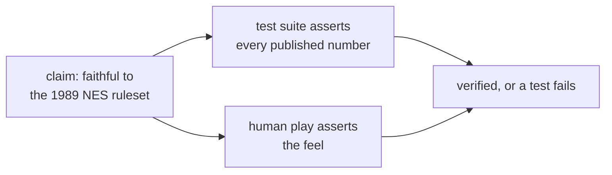

# Intent

This project is an engineering study: reimplement the 1989 NES Tetris
ruleset (NTSC) from scratch, exactly as it shipped, and prove the fidelity
with tests rather than vibes.

## The thesis

**Every 1989 mechanic, zero 1989 presentation.**

The mechanics are the subject. The NES gravity table, DAS timing, the
entry delay, the randomizer's reroll, the scoring order: these are all
published, documented numbers, which means "faithful" is a checkable claim,
not a feeling. The test suite asserts every one of them.

Presentation is explicitly out of scope. No sprite art, no level palettes,
no music, no title-screen chrome. The game renders as flat colours on a
plain canvas, like a well-made diagram. Equally out of scope is the modern
Tetris Guideline: no hold piece, no ghost piece, no hard drop, no wall
kicks, no 7-bag randomizer. Those are later inventions; this build is a
period piece.

## Why build it

1. The core of Tetris is about 300 lines of pure state manipulation, small
   enough to hold in your head, deep enough that three of its mechanics
   (locking, wall charging, floor slides) emerge from the code rather than
   being written into it.
2. The published tables make it a rare project where correctness has an
   external answer key.
3. The horizontal mode (see [horizontal-mode.md](horizontal-mode.md)) is an
   original design experiment built to test whether the core was as pure as
   claimed. It was: the rules never learned which way is down.

## Verification philosophy

Two layers, by design:

- **The test suite asserts the numbers.** Gravity frames per level, DAS
  16/6, scoring 40/100/300/1200 x (level + 1), ARE 10 to 18 by lock height,
  the LFSR's period of 32767. If a table value drifts, a test fails.
- **A human asserts the feel.** Tap precision, the DAS glide, wall
  charging, floor slides, the lock-pause-spawn rhythm. No test can sign
  these off; playing is part of the verification, not a demo.

Where the implementation knowingly deviates from cycle-exact NES behaviour,
the deviation is recorded in [mechanics.md](mechanics.md), not hidden.

## A note on the name

Tetris is a trademark of The Tetris Company, and its look-and-feel has been
successfully litigated. This repository is a private study. It is not
distributed publicly, and if it ever were, it would ship under a different
name and presentation.
