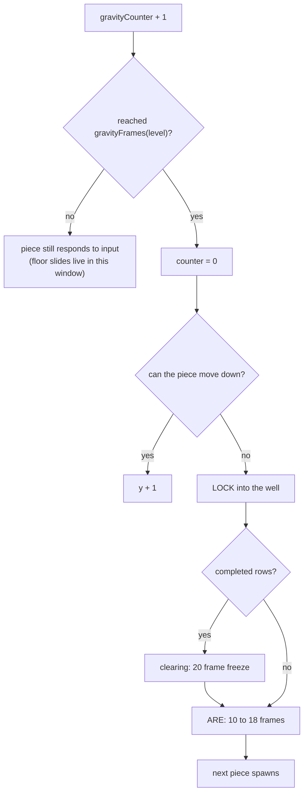
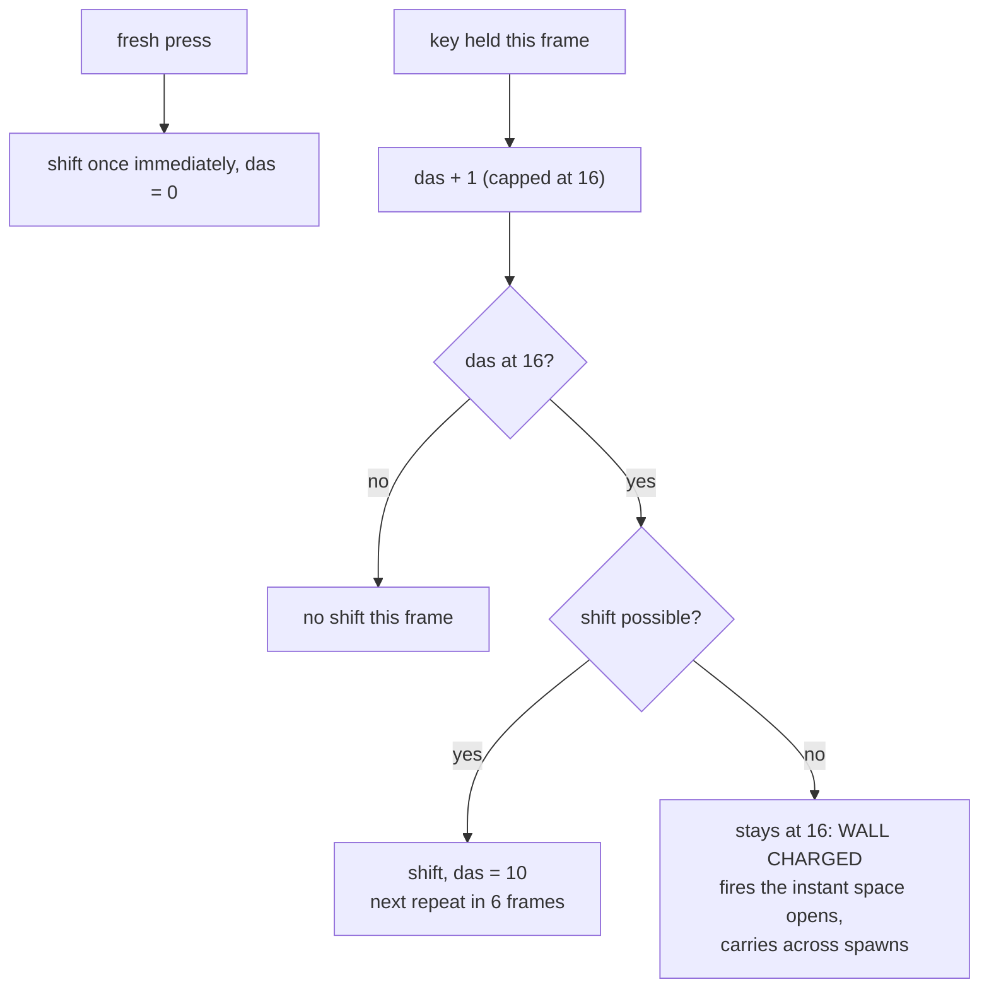
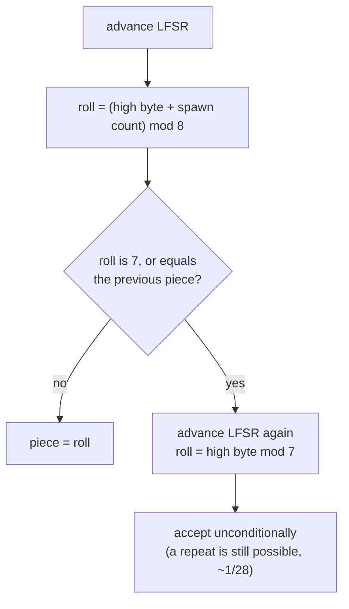

# Mechanics

The 1989 NES Tetris ruleset (NTSC), as implemented here. Every number in
this document is asserted by the test suite in `test/`.

## Playfield and spawning

- The well is 10 columns by 20 rows.
- Every piece spawns at column 5, row 0, in its spawn orientation.
- A spawned piece that overlaps the stack locks in place and ends the game
  (top out).

## Rotation: the Nintendo Rotation System (NRS)

- T, J and L have 4 orientations; S, Z and I toggle between 2; O has 1.
  S, Z and I return to the same cells every other rotation, so there is
  no wobble.
- T, J and L spawn pointing down (flat bar, nub or foot below); S, Z and I
  spawn horizontal.
- **There are no wall kicks.** A rotation that would collide simply fails
  and the piece stays as it was. A vertical piece hugging a wall will not
  rotate; this is correct behaviour, not a bug.
- Rotation is edge-triggered: one step per button press, no auto-repeat.
- Cells above the well (y < 0) count as collisions, so the I piece cannot
  go vertical until it has fallen two rows clear of the ceiling.

## Gravity and locking

Frames the piece waits before dropping one row, by level:

| Level | 0 | 1 | 2 | 3 | 4 | 5 | 6 | 7 | 8 | 9 | 10-12 | 13-15 | 16-18 | 19-28 | 29+ |
|---|---|---|---|---|---|---|---|---|---|---|---|---|---|---|---|
| Frames | 48 | 43 | 38 | 33 | 28 | 23 | 18 | 13 | 8 | 6 | 5 | 4 | 3 | 2 | 1 |

There is **no lock-delay timer**. The piece locks on the gravity tick it
fails to fall. Between gravity ticks a resting piece still responds to
shifts and rotations, which is why floor slides are possible at low levels
and effectively vanish at high ones.

## DAS (delayed auto-shift)

- A fresh press moves the piece one column immediately and zeroes the
  counter.
- Holding charges the counter one per frame; at 16 the piece shifts and
  the counter reloads to 10, so repeats fire every 6 frames.
- A blocked shift leaves the counter fully charged at 16. This is wall
  charging: hold into a wall, and the next piece shifts on its first frame.
- The counter keeps charging during line clears and entry delay, so a held
  direction carries its charge across spawns.
- Horizontal input is ignored entirely while Down is held; you cannot
  shift and soft-drop at the same time.

## Soft drop

- One row every 2 frames while Down is held.
- Scores 1 point per row of the final uninterrupted descent, awarded at
  lock. Releasing Down forfeits the accumulated rows.
- Down must be released after each spawn before it applies again, so
  holding Down through a lock cannot slam the next piece.

## The randomizer

- The PRNG is a 16-bit LFSR: feedback bit is bit 9 XOR bit 1, the register
  shifts right, the feedback enters at bit 15. Period: 32767. This is a
  transliteration of the cartridge's 6502 routine.
- Piece selection rolls 0 to 7. A roll of 7, or a roll equal to the
  previous piece, triggers exactly one reroll, accepted unconditionally.
- Net effect: back-to-back repeats happen about 1 in 28 instead of 1 in 7,
  and droughts are real. This is not the modern 7-bag.

## Line clears

- Completed rows freeze play for 20 frames while the cells blank out in
  column pairs from the centre outward, one pair per 4 frames.
- After the freeze the stack collapses and the entry delay runs.

## ARE (entry delay)

After a piece locks, the next one spawns 10 to 18 frames later, set by how
low the piece locked: 10 frames in the bottom two rows, plus 2 per 4-row
band above, capped at 18.

## Scoring and levels

- Line scores: 40 / 100 / 300 / 1200 for 1 / 2 / 3 / 4 lines, multiplied
  by (level + 1).
- The NES levels up first and scores second, so a clear that triggers a
  level-up is multiplied by the new level.
- Score caps at 999,999.
- From a starting level s, the first level-up comes at
  min((s + 1) * 10, max(100, s * 10 - 50)) lines, then every 10 lines.
  Starting at level 9 holds for a full 100 lines.

## Pause

Pausing hides the playfield, as the NES does. No free planning time.

## Deliberate deviations

Where this is not cycle-exact NES behaviour:

- The randomizer's second roll uses a fresh LFSR byte mod 7; hardware mixes
  in the previous piece's orientation id. Distribution is near-identical.
- The NES reads out-of-bounds memory for cells above the well; this build
  treats them as collisions, so behaviour in the top two rows differs
  subtly.
- The clear freeze is a flat 20 frames; the NES varies between 17 and 20
  with PPU timing.
- The pushdown counter has no BCD wraparound bug above 15 rows.
- NTSC only. PAL has its own gravity and DAS tables; they are not here.
